# SittingWatch——基于监控摄像头的智能坐姿分析系统(端侧实现)

云端部分由王海生同学完成，仓库如下：
https://github.com/Hanson-Wang-chn/SittingWatch

## 一、项目简介

- SittingWatch 是一款基于计算机视觉的智能坐姿监测系统，专为长期伏案工作者设计。本项目的端侧实现，旨在通过摄像头动态实时响应的方式（用户无感）和基于静态图像识别的精确分析（用户主动参与）两种方式，尽早发现和干预，预防因不良姿势导致的健康问题。

- **核心技术栈​**​：
	- 核心算法：OpenCV姿态识别 + 自定义分类模型
	- 后端框架：Python Flask + 多线程任务调度
	- 前端界面：HTML5/CSS3响应式设计
	- 数据分析：qwen大语言模型

- **​应用场景​**​：
	- 远程办公族的健康守护者
	- 学生群体的坐姿矫正助手
	- 电竞玩家的健康管理工具
	- 康复训练的姿势监测设备
---
## 二、环境依赖安装与运行

- `requirements.txt`
```txt
Flask==3.1.1  
Flask_Cors==4.0.0  
flask_mail==0.10.0  
mediapipe==0.10.21  
numpy==1.24.2  
openai==1.90.0  
opencv_python==4.9.0.80  
pandas==1.5.3  
Requests==2.32.4
```
- 在项目根目录执行：
```bash
pip install -r requirements.txt
```
- 运行app.py文件
- 打开前端页面/本地ip地址（目前未部署上云）

---
## 三、文件组织结构

```md
hunchback/                    # 项目根目录
│
│  
├── app.py                    # Flask应用主入口
├── requirements.txt          # Python依赖包列表
├── tree.txt                  # 目录结构记录文件
├── users.json                # 存储用户账户信息
│
├── .idea/               
│
│  # 图像处理核心功能模块(捕获→预处理→检测→分类/分析)
├── core/
│   ├── __init__.py           
│   ├── analyzer.py           # 姿势分析模块(处理视频流、图片)
│   ├── capture.py            # 摄像头视频帧捕获
│   ├── classifier.py         # 姿态异常判断（调用云端自训练大模型接口）
│   ├── detecter.py           # 通过人体关键点计算矫正参数
│   ├── preprocessing.py      # 对用户上传图像进行预处理（多种基本数字图像方法）
│   └── scheduler.py          # 任务调度、异常姿势持续检测与警报机制
│
│  # 前端
├── frontend/
│   ├── css/                  # 样式
│   │   ├── daily_report.css  
│   │   ├── index.css         
│   │   └── login.css         
│   │
│   ├── html/                 # HTML模板
│   │   ├── daily_report.html # 日报分析页面
│   │   ├── index.html        # 首页（摄像头实时监测/上传图片识别）
│   │   └── login.html        # 登录注册页面
│   │
│   └── img/                  # 静态图片资源
│
│  # 日志文件(持久化存储用于分析用户历史坐姿)
├── logs/
│   └── posture_log.csv       # 姿势信息记录(时间戳+关键值)
│
│  # 大模型调用板块
├── models/
│   └── report_generator.py   # 调用大语言模型分析日志文件生成报告（邮箱内容）
│
│ 
├── static/
│   └── tmp/                  # 临时文件目录(预处理增强和标注后的用户上传图片)
│
│  # 工具模块
└── utils/
    ├── config.py             # 配置管理(服务端口、异常通知阈值设定、smtp配置)
    └── emailer.py            # 邮件发送服务
```

---
## 四、基本功能说明
### 1 用户管理
#### 1.1 注册

- 用户通过填写注册表单创建账户。
- 邮箱用于分析报告的发送、持续检测到异常时进行提醒。
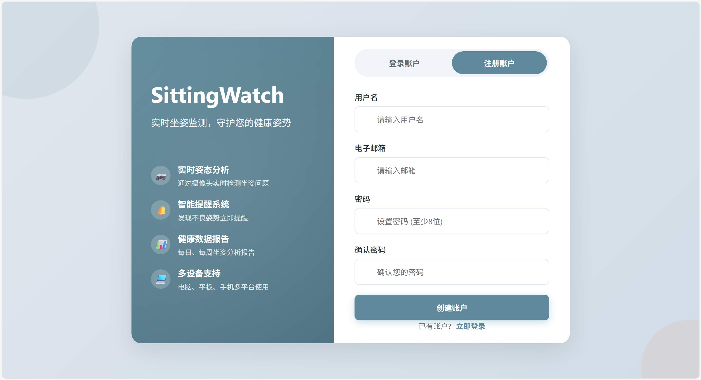
#### 1.2 登录

- 用户通过邮箱和密码登录系统。
- 登录成功后，用户可以访问系统的各项功能。
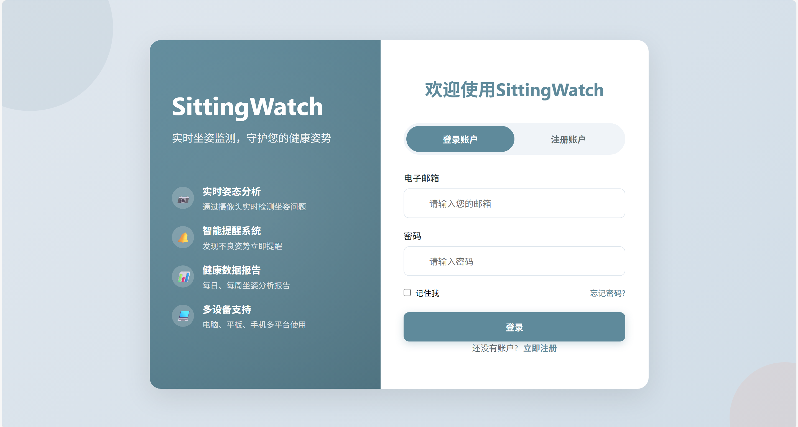

### 2 实时姿势监测系统

- 基于摄像头的动态实时姿势分析和异常检测
#### 2.1 人体节点动态标注

- 实时检测人体关键点
- 在视频流中实时绘制骨骼连接线
- 计算关键角度（耳-肩角度、肩-髋角度）
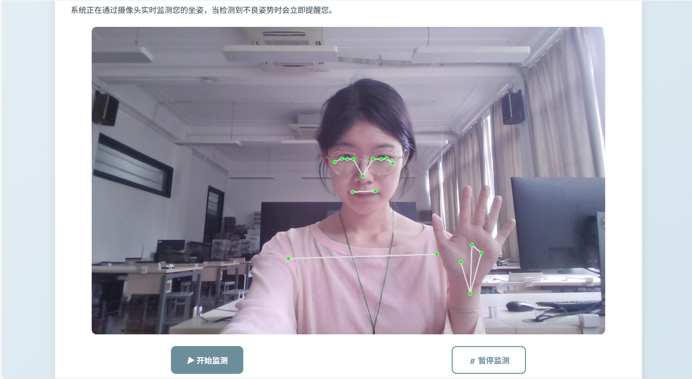
#### 2.2 不良姿态检测与实时警告

根据关键角度（耳-肩角度、肩-髋角度）进行姿态检测。
- **检测类型**：
	1. **驼背检测**
	2. **低头检测**
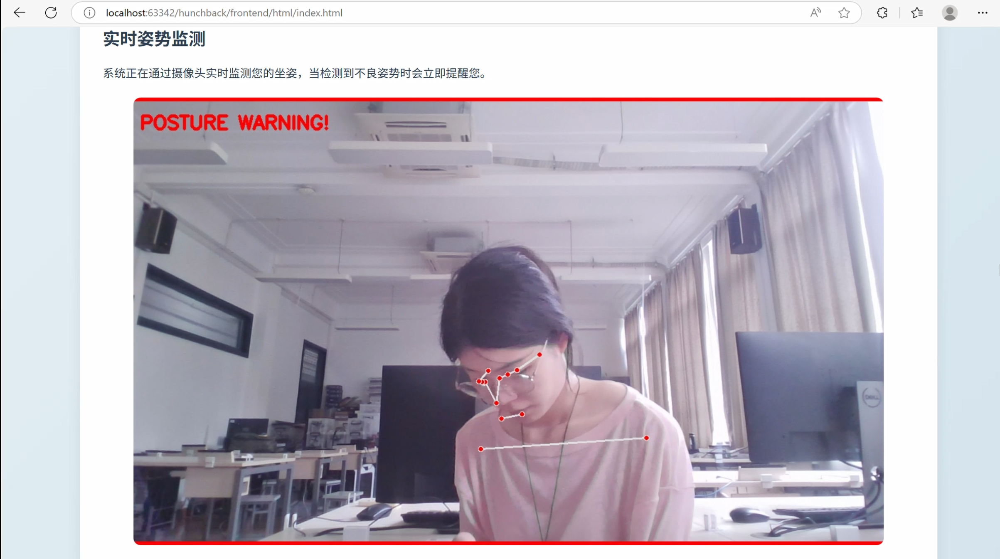
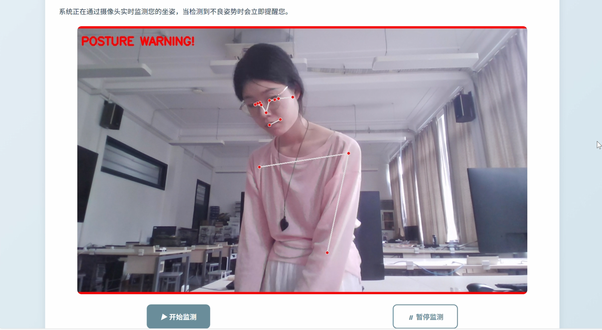
  - 排除了正常弯腰的干扰
  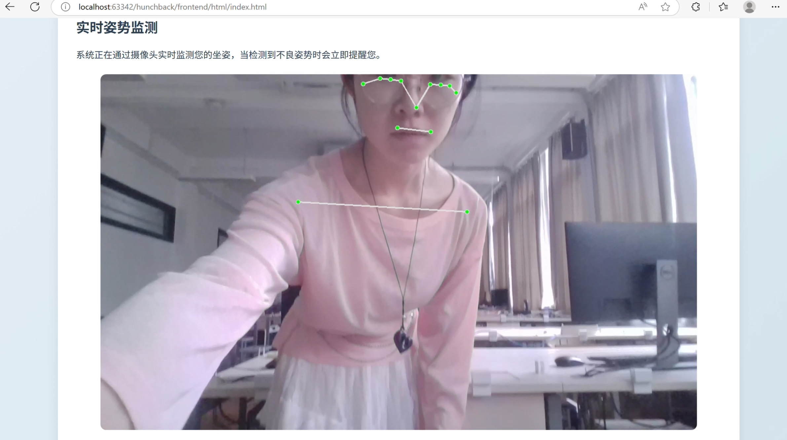
#### 2.3 定时截取视频帧画面，记录日志

- 每3s截取一视频帧画面进行分析，分析并记录日志
- 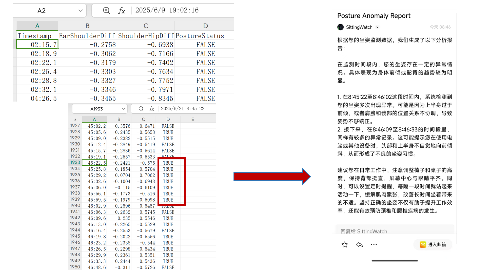
- 持续异常计数机制
- 达到阈值后触发邮件发送
- 使用Flask-Mail发送HTML格式报告


#### 2.4 持续姿势异常触发邮箱提醒
- 日志中每3s记录一次，如果持续10次触发异常就会触发邮件提醒
- 邮件内容是调用qwen大模型接口，根据csv日志文件的时间戳，角度计算，姿势检测结果的判断，生成分析报告和改善建议。
- 使用smtp邮箱代理自动发送
	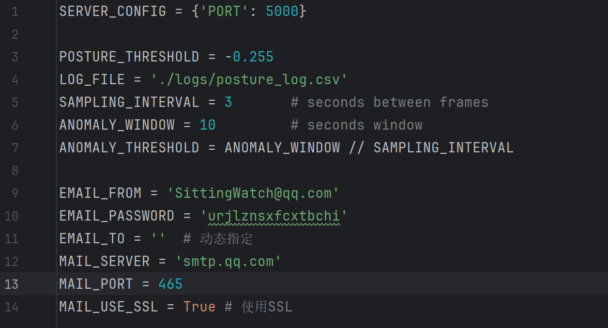
- 分析报告示例1
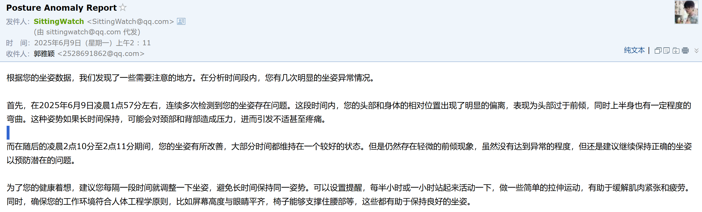
- 示例2
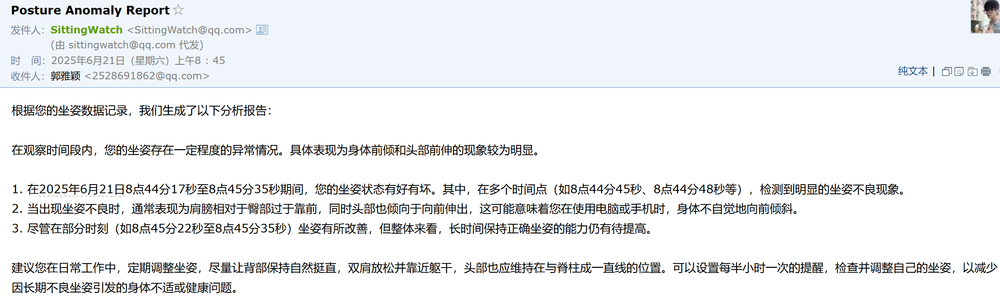

### 3 基于图片上传的静态精确姿态检测

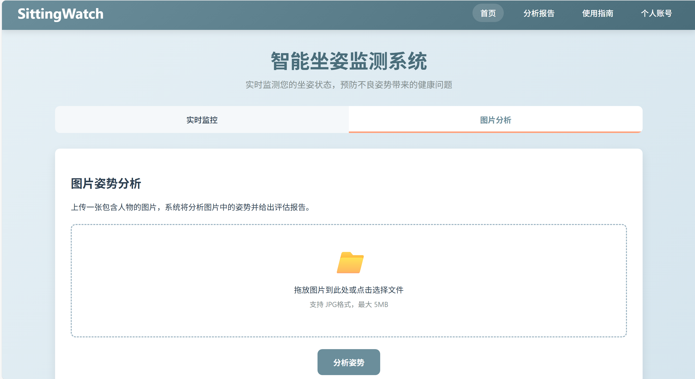
#### 3.1 对上传的图片预处理
```python
def correct_perspective(image, src_points, dst_points):  
    # 透视变换校正  
def rotate_and_scale(image, angle, scale):  
    # 旋转并缩放
def rotate_scale_translate(image, angle, scale, tx, ty):  
    # 旋转、缩放和平移 
def histogram_equalization(image):  
    # 直方图均衡化
def adaptive_histogram_equalization(image, clipLimit=2.0, tileGridSize=(8, 8)):  
    # CLAHE 自适应直方图均衡化（彩色图：只增强 Y 通道；灰度图：直接增强）
def denoise(image):  
    # 去噪（双边滤波）   
def sharpen(image):  
    # 锐化（拉普拉斯算子）   
def gaussian_highpass(image, ksize=(0,0), sigma=10):  
    # 空域高斯高通滤波
```
- 效果示例图
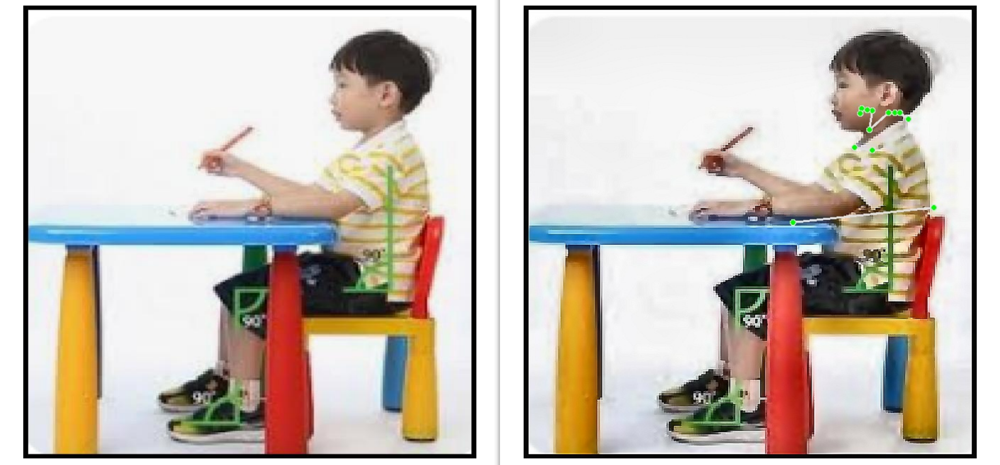

#### 3.2 调用云端自训练模型进行异常姿态判断

- 输入：一张图片。
- 处理：使用在我们自制的数据集上训练的YOLOv8模型，实现坐姿“好”与“坏”的二分类，同时得到置信度。
- 输出：好/坏/未检测到/服务器忙，以及置信度值。
```bash
curl -X POST -F "image=@path/to/your/test.jpg" http://localhost:6666/detect
```

返回JSON格式的数据：

```json
{"class":"sitting_bad","conf":"0.7605"}
```


#### 3.3 基于静态图片的人体节点标注图
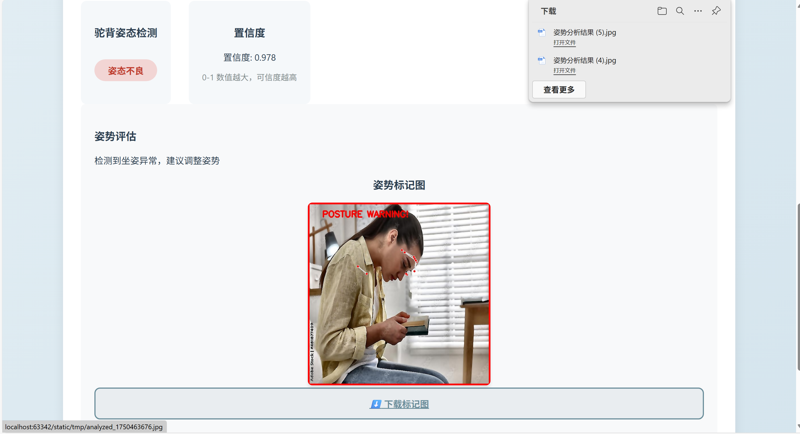
- 提供预处理增强并标注后的图片下载

#### 4 用户主动选择生成的分析报告

- 用户可选择日期，通过日期查找日志，生成姿势分析报告，提供姿势分析和建议
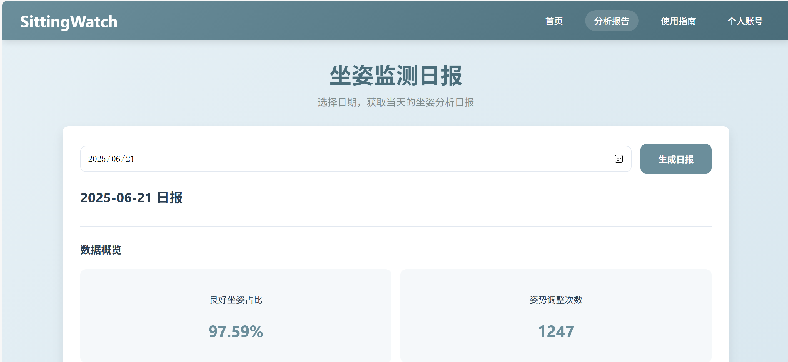
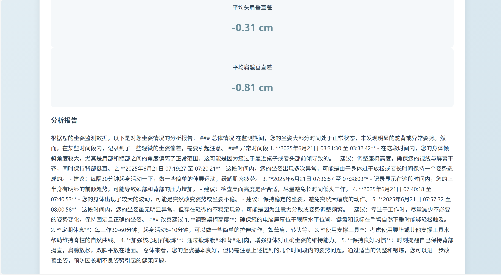
- 当日没有监测数据的情况
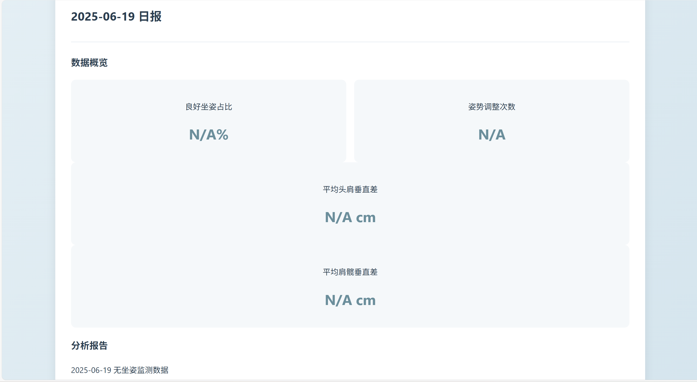

